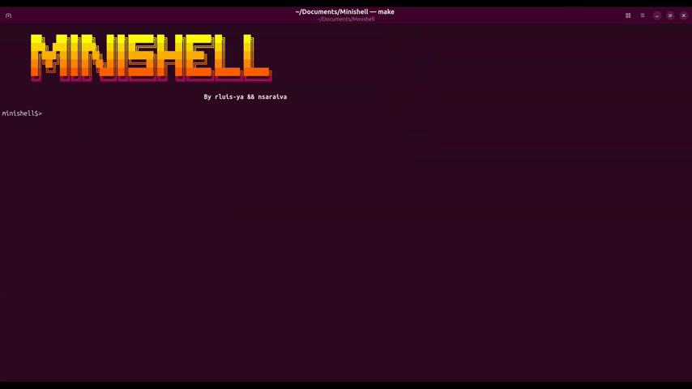

# Minishell


> A fully-featured UNIX shell built from scratch in C as part of the 42 School curriculum.
> Features a hand-written lexer, recursive-descent parser, AST-based executor, and complete
> bonus support for `&&`, `||`, `*` wildcards, and `()` subshells.



---

## Table of Contents

- [About the Project](#about-the-project)
- [Features](#features)
- [Bonus Features](#bonus-features)
- [Built-in Commands](#built-in-commands)
- [Installation](#installation)
- [Usage](#usage)
- [Usage Examples](#usage-examples)
- [Architecture](#architecture)
- [Project Structure](#project-structure)
- [Authors](#authors)

---

## About the Project

**Minishell** is a minimal UNIX shell written in pure C. It faithfully reimplements the core
behaviour of `bash`, including command execution, piping, all four I/O redirection operators,
environment-variable expansion, heredocs, and a robust signal-handling strategy.

The parser constructs a full **Abstract Syntax Tree (AST)**, enabling clean, recursive execution
of arbitrarily complex command sequences — including pipelines nested inside logical operators
and subshells. The project is built with strict Norminette compliance and zero memory leaks.

---

## Features

### Core Shell Behaviour

| Feature | Description |
|---|---|
| **Prompt** | Displays `minishell$> ` when waiting for input |
| **History** | Full readline-backed command history (↑ / ↓ arrows) |
| **Executables** | Resolves commands via `PATH`, or as relative / absolute paths |
| **Single quotes** | `'...'` suppresses all meta-character interpretation |
| **Double quotes** | `"..."` suppresses everything except `$` expansion |
| **`<` redirect** | Redirect stdin from a file |
| **`>` redirect** | Redirect stdout to a file (truncate) |
| **`>>` redirect** | Redirect stdout to a file (append) |
| **`<<` heredoc** | Read lines from stdin until the delimiter is matched |
| **Pipes `\|`** | Chain command stdout → stdin across multiple processes |
| **`$` expansion** | Expands environment variables inline |
| **`$?`** | Expands to the exit status of the last foreground pipeline |
| **Signals** | `Ctrl-C` re-prompts · `Ctrl-D` exits · `Ctrl-\` is ignored |

### Bonus Features

| Feature | Description |
|---|---|
| **`&&` logical AND** | Execute right-hand side only if left-hand side exits with 0 |
| **`\|\|` logical OR** | Execute right-hand side only if left-hand side exits non-zero |
| **`*` wildcard** | Glob-expands a pattern against the current working directory |
| **`()` subshell** | Groups command sequences; runs them in a forked child process |

---

## Built-in Commands

| Command | Behaviour |
|---|---|
| `echo [-n] [args…]` | Print arguments; `-n` suppresses the trailing newline |
| `cd [path\|~]` | Change working directory; updates `PWD` and `OLDPWD` |
| `pwd` | Print the absolute pathname of the current working directory |
| `export [var=val…]` | Set / update environment variables; no args prints sorted list |
| `unset [var…]` | Remove variables from the environment |
| `env` | Print all currently exported environment variables |
| `exit [n]` | Exit the shell with optional numeric status code (0–255) |

---

## Installation

### Prerequisites

- A POSIX-compliant OS (Linux / macOS)
- `cc` (clang or gcc)
- GNU **readline** development library

```bash
# Debian / Ubuntu
sudo apt-get install libreadline-dev

# macOS (Homebrew)
brew install readline
```

### Build

```bash
git clone https://github.com/Techneera/Minishell.git
cd Minishell
make
```

This produces the `minishell` executable in the repository root.

To build with **AddressSanitizer** for memory debugging:

```bash
make asan
```

### Clean

```bash
make clean   # remove object files only
make fclean  # remove object files + binary
make re      # fclean then full rebuild
```

---

## Usage

```bash
./minishell
```

---

## Usage Examples

```bash
# Basic command
minishell$> echo "Hello, World!"
Hello, World!

# Environment variable expansion
minishell$> echo $HOME
/home/user

# Exit status expansion
minishell$> ls /nonexistent; echo $?
ls: /nonexistent: No such file or directory
2

# Pipe chain
minishell$> ls -la | grep "\.c" | wc -l

# Input / output redirections
minishell$> cat < input.txt > output.txt
minishell$> echo "log entry" >> logfile.txt

# Heredoc
minishell$> cat << EOF
> line one
> line two
> EOF

# Logical AND (bonus)
minishell$> make && ./minishell

# Logical OR (bonus)
minishell$> cat missing_file || echo "file not found"

# Subshell (bonus)
minishell$> (cd /tmp && ls)

# Wildcard expansion (bonus)
minishell$> echo *.c
```

---

## Architecture

See [ARCHITECTURE.md](ARCHITECTURE.md) for a detailed technical breakdown of the lexer,
recursive-descent parser, AST node types, execution engine, pipe model, and signal strategy.

---

## Project Structure

```
Minishell/
├── shell.c                  # Entry point: main(), REPL loop, env initialisation
├── include/
│   ├── libshell.h           # Core data structures and shared type definitions
│   ├── lexer.h              # Lexer (tokeniser) public API
│   ├── ast.h                # Recursive-descent parser and AST builder API
│   ├── expansion.h          # Variable / quote / wildcard expansion API
│   └── execution.h          # Execution engine, built-ins, and utilities API
├── src/
│   ├── lexer/               # Tokenisation: operators, words, heredoc delimiters
│   ├── ast/                 # Parser: and/or, pipeline, subshell, simple command
│   ├── execution/           # Executor: pipes, redirections, fork, built-ins, signals
│   ├── expansion/           # Word expansion: variables, quotes, wildcard masking
│   ├── builtins/            # echo, exit, exit_status, unset
│   └── wildcard/            # Glob pattern matching against the filesystem
└── libft/                   # Custom C standard-library re-implementation
```

---

## Authors

- **rluis-ya** — 42 Porto
- **nsaraiva** — 42 Porto
